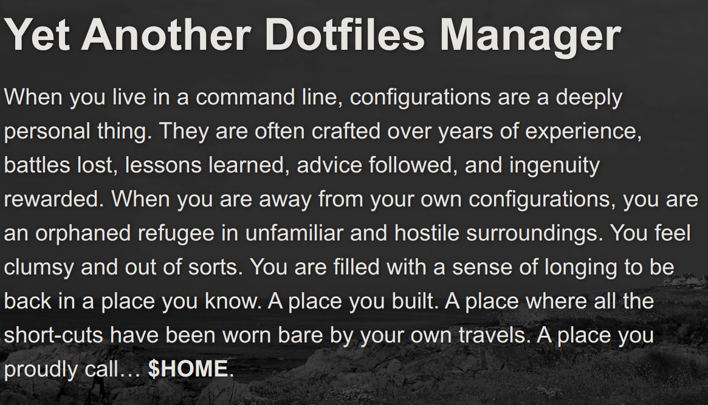

### What is the problem we are solving?

<br />
<br />
<br />
<br />
<br />
<br />
<br />
<br />
<br />
<br />
<br />
<br />

#### Who here knows anything about dotfiles?

<br />
<br />
<br />
<br />
<br />
<br />
<br />
<br />
<br />
<br />
<br />
<br />

(neo)vim -> .vim/ or .vimrc or .config/nvim/\* <br />
tmux     -> .tmux-config or .config/tmux/...  <br />
...  <br />

What if you want to add more programs?  You got to the required spot and add
the config.

But what about persisting or sharing?

Need store them in git
from git -> the dotfile locations

<br />
<br />
<br />
<br />
<br />
<br />
<br />
<br />
<br />
<br />
<br />
<br />

### We want something that can store and make available our dotfiles

<br />
<br />
<br />
<br />
<br />
<br />
<br />
<br />
<br />
<br />
<br />
<br />

### There are two solutions you should try!
* yadm
* stow

<br />
<br />
<br />
<br />
<br />
<br />
<br />
<br />
<br />
<br />
<br />
<br />

### YADM
* repo, in the shape of your dotfiles, and it will install them for you


<br />
<br />
<br />
<br />
<br />
<br />
<br />
<br />
<br />
<br />
<br />
<br />

```
.config/
  nvim/
    init.vim
```

<br />
<br />
<br />
<br />
<br />
<br />
<br />
<br />
<br />
<br />
<br />
<br />

```
yadm clone git@github.com:ThePrimeagen/dotfiles
```

<br />
<br />
<br />
<br />
<br />
<br />
<br />
<br />
<br />
<br />
<br />
<br />

```
.config/
  nvim/
    plugins/
      lsp.vim
    init.vim
```

<br />
<br />
<br />
<br />
<br />
<br />
<br />
<br />
<br />
<br />
<br />
<br />

```
yadm add .config/nvim/plugins/lsp.vim
```

<br />
<br />
<br />
<br />
<br />
<br />
<br />
<br />
<br />
<br />
<br />
<br />

### I think you get the idea right?

<br />
<br />
<br />
<br />
<br />
<br />
<br />
<br />
<br />
<br />
<br />
<br />

### So lets talk about stow
So I think stow is amazing.
* Its very simple
* It only manages symlinks
* Which allows it to be OS and version-able

<br />
<br />
<br />
<br />
<br />
<br />
<br />
<br />
<br />
<br />
<br />
<br />

### To install and follow along
```
sudo apt install stow
```

```
brew install stow
```

<br />
<br />
<br />
<br />
<br />
<br />
<br />
<br />
<br />
<br />
<br />
<br />

### lets do some very basic examples

<br />
<br />
<br />
<br />
<br />
<br />
<br />
<br />
<br />
<br />
<br />
<br />

### lets do some very basic examples

<br />
<br />
<br />
<br />
<br />
<br />
<br />
<br />
<br />
<br />
<br />
<br />

### Examples I should cover
* Simple example
* Up leveling the symlink
* Removing Stow'd items
* Collisions
